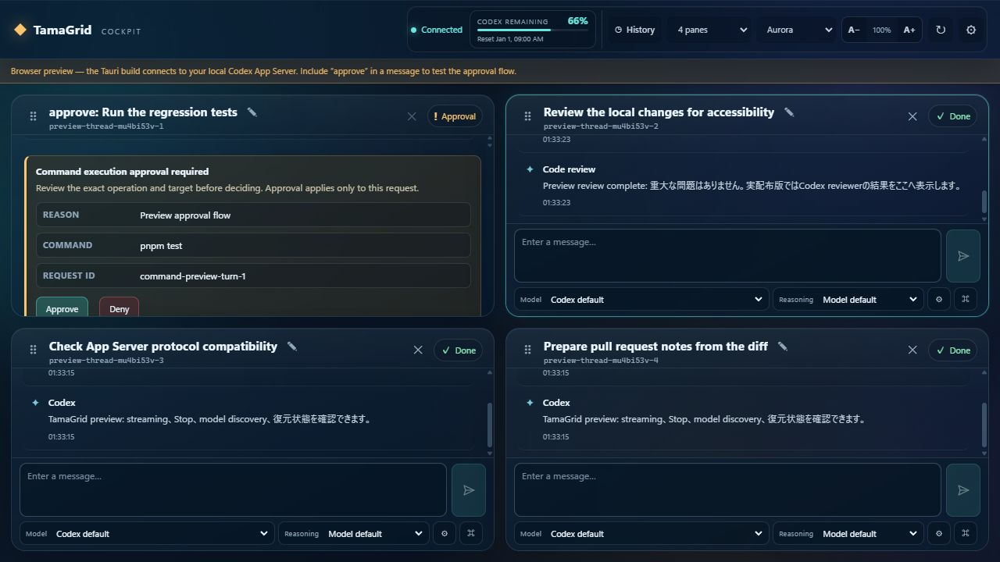
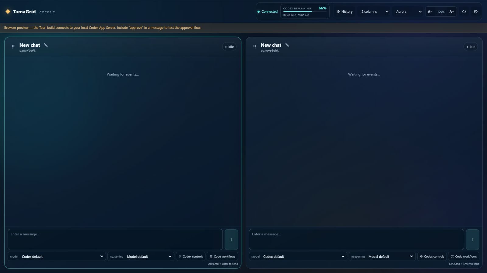

# TamaGrid

**A local-first, open-source desktop cockpit for supervising multiple Codex App Server tasks, approvals, diffs, and reviews on Windows and macOS.**

> TamaGrid is an independent open-source project and is not affiliated with or endorsed by OpenAI.

[](https://github.com/tamas-hub/tamagrid/actions/workflows/ci.yml)
[](https://github.com/tamas-hub/tamagrid/actions/workflows/security.yml)
[](LICENSE)



*Privacy-safe browser preview using simulated tasks and usage values. It is a UI demonstration, not evidence of live Codex execution or adoption.*

## What is TamaGrid?

TamaGrid is a local-first, MIT-licensed desktop client for developers supervising up to four independent Codex tasks. It launches your own `codex app-server` and brings thread history, progress, approvals, code changes, and review controls into one workspace. Execution and authentication remain with your Codex installation; TamaGrid does not supply Codex, models, or a relay service.

## Why TamaGrid exists

Supervising several development tasks can scatter terminals, approvals, thread history, diffs, and model settings across windows. TamaGrid provides one place to see each task and decide what happens next, while keeping the user's existing Codex environment and local execution model.

## Quick Start

1. **Prepare Codex.** Install [OpenAI Codex](https://developers.openai.com/codex/) from its official distribution and authenticate in Codex as needed. TamaGrid does not ask for an OpenAI API key or handle sign-in.
2. **Get TamaGrid.** Download the package for your platform from [GitHub Releases](https://github.com/tamas-hub/tamagrid/releases/tag/v0.7.0). Verify its checksum and provenance using [Download and verification](#download-and-verification). Preview builds are unsigned on Windows and not notarized on macOS.
3. **Detect the executable.** Open Settings, choose **Auto detect** or **Choose executable**, and confirm the native Codex executable. First use, path changes, and changed SHA-256 fingerprints require native confirmation.
4. **Test connection.** Select **Test connection** to check the executable, App Server initialization, authentication state, and available models.
5. **Start a task.** Choose a working directory and pane, keep the safe default policy or explicitly select your settings, and send a task. Use **History** to resume a thread, **Stop** or **Steer** for an active task, and the pane's approval card to review requests.

## Core capabilities

| Workflow | What TamaGrid provides |
| --- | --- |
| Supervise multiple tasks | Up to four panes, independent threads, progress and streamed command/file-change events |
| Continue work | Search and resume saved threads into a chosen pane; rename chats; Stop and Steer active tasks |
| Select models | Discover models, reasoning options, and service tiers from App Server; display usage limits and reset times |
| Review changes | Inspect diffs; run Codex code review against a working tree, base branch, commit, or custom instructions |
| Prepare a PR | Review the local diff and tests and draft a title/body; publishing a PR is a separate explicit operation |
| Keep control | Per-pane sandbox and approval settings, explicit Approve/Deny, native confirmation for elevated authority |
| Use the desktop accessibly | Windows/macOS, English/Japanese, keyboard alternatives, visible status text, and 90–200% font sizing |

## Why it matters for Codex workflows

The repository offers an independent integration example for multi-task human supervision through the [Codex App Server protocol](https://learn.chatgpt.com/docs/app-server). A typed React adapter and Rust IPC layer multiplex local threads over stdio, preserving thread/turn identity, approval requests, and execution-policy boundaries in the UI.

Model IDs and reasoning choices come from `model/list`, not a fixed product catalog. The compatibility checker compares the methods, events, and wire values used by TamaGrid with schemas generated by the installed Codex executable. Authentication stays in Codex, with no TamaGrid credential store or API proxy. See [Architecture](docs/ARCHITECTURE.md) for the transport, event routing, lifecycle, and compatibility contract.

## Security & privacy model

- **Executable trust:** canonical native paths, first-use/change confirmation, SHA-256 pinning, and a final fingerprint check before fixed-argument, shell-free launch.
- **Approval boundary:** method-specific Rust IPC validates input; unsupported server requests fail closed. Elevated `never` / `danger-full-access` modes require confirmation for each turn and are not persisted.
- **Data boundary:** no TamaGrid relay, credential storage, or custom telemetry. Conversation bodies, command output, diffs, and pending approvals are not stored by TamaGrid. Safe workspace settings and thread references are stored locally.
- **Network scope:** local-first does not mean offline. Your Codex App Server communicates with OpenAI and may use services configured in your Codex environment.
- **Verification:** [Security policy and control map](SECURITY.md), [detailed threat model](docs/SECURITY.md), [dated security review and residual risks](SECURITY_REVIEW.md), and [release provenance](PUBLIC_RELEASE_CHECKLIST.md#published-v070-evidence).

## Project status / compatibility

TamaGrid is an **early-stage Public Preview**. The latest published release is [v0.7.0](https://github.com/tamas-hub/tamagrid/releases/tag/v0.7.0); Windows packages are not Authenticode-signed, and macOS packages are ad-hoc signed without Developer ID notarization. The release includes checksums, a production JavaScript SBOM, and GitHub Artifact Attestations. These establish build provenance, not platform signing or bit-for-bit reproducible builds.

Windows x64 and macOS Apple Silicon/Intel packages share the Tauri 2 / Rust / React codebase. CI checks Windows and macOS native builds; the release gate covers all three targets. The original App Server schema snapshot used Codex CLI 0.147.0; the schema check also passed against 0.148.0 on 2026-09-17. This is a schema check, not a claim that every runtime path or future Codex version has been tested.

Current boundaries include stdio transport, command/file-change approvals, and local PR preparation. Remote transport, experimental App Server APIs, automatic updates, and trusted platform signing remain outside the implemented scope. See [known limitations](#current-scope-and-known-limitations), [Changelog](CHANGELOG.md), and [release policy](docs/RELEASING.md).

## Contributing

Start with the English [contribution guide](CONTRIBUTING.md) for prerequisites, development, tests, and the PR process. [Maintainers and maintenance priorities](MAINTAINERS.md) describes responsibility and ongoing work. Report reproducible bugs and focused proposals through the [issue templates](https://github.com/tamas-hub/tamagrid/issues/new/choose); use [private vulnerability reporting](SECURITY.md#reporting-a-vulnerability) for security issues.

日本語の機能・操作・安全性の詳細は、この下に残しています。TamaGridはユーザー自身のCodex環境を利用する、非公式のOSSです。

## Download and verification

The published [Public Preview release](https://github.com/tamas-hub/tamagrid/releases/tag/v0.7.0) provides:

- Windows `TamaGrid_*_x64-setup.exe` — standard interactive installer
- Windows `TamaGrid_*_x64_en-US.msi` — for environments requiring MSI
- macOS `.dmg` / `.app.tar.gz` — Apple Silicon and Intel, ad-hoc signed, not notarized

Windows SmartScreen and macOS Gatekeeper may warn about these builds. Do not disable those protections. Check the official repository release origin and `SHA256SUMS.txt`, and run a package only if you trust it. Managed-device policies may prevent installation. Do not run an artifact whose checksum does not match.

On Windows, check the checksum and signing status:

```powershell
Get-FileHash -LiteralPath .\TamaGrid_0.7.0_x64-setup.exe -Algorithm SHA256
Get-AuthenticodeSignature -LiteralPath .\TamaGrid_0.7.0_x64-setup.exe
```

With GitHub CLI, run `gh attestation verify <artifact> --repo tamas-hub/tamagrid` to verify build provenance. Each release also includes `RELEASE_NOTES.md`, `THIRD_PARTY_NOTICES.md`, and `tamagrid-js.cdx.json`. Attestation does not replace OS code signing; see [platform signing limitations](docs/CODE_SIGNING.md).

## Detailed capabilities / 機能詳細

- 2列、2×2の4分割、横4列、縦4段を切り替えられる最大4Pane
- Paneのドラッグ＆ドロップ並べ替えと、キーボードの `Alt` + 矢印キーによる代替操作。並び順も保存
- Codexの保存済みthreadを検索・展開し、選択Paneでresume
- `thread/name/set` / `thread/name/updated` と保存履歴を反映した、編集可能な実際のchat名表示。未命名時だけ「新しいチャット」と表示
- Codex native executableの自動検出とRust側native file picker。初回・path変更・内容のSHA-256変更時は、実行前にnative確認が必要。WebViewから実行pathを指定不可
- 起動時・再接続時・認証変更時・手動操作での動的model discovery
- App Serverが提示したreasoning effortだけを表示
- Aurora、Dark、Light、Greenから選んで保存できるグラスモーフィズムCockpit UI
- Englishを初期表示とし、接続status rail内のEN / JP切替で日本語へ即時変更。日時localeとともに端末へ保存
- 全themeでnative selectの候補まで明示的な前景色・背景色を持つ高contrast UI
- HeaderとSettingsから90%〜200%を10%刻みで変更・保存できるfont size
- 3行を初期高として10行まで自動拡張し、model・reasoning controlsを入力欄の下へまとめたcompact composer
- TamaGrid、接続状態、残り使用量、History、各操作、window controlsを1行にまとめたnative desktop header
- Pane単位のapproval policy、sandbox、personality、reasoning summary、動的service tier。`never` / `danger-full-access` はturnごとにnative確認し、保存しない
- Codex App Serverが返す残り使用量、利用枠、reset時刻のlive表示
- assistant message、commandと終了code、file change、diff、plan、progress、errorのstreaming表示
- streaming更新ごとに最新行へ追従するtimeline auto-scroll
- Enter送信（Shift+Enterで改行）またはCtrl/Cmd+Enter送信を端末ごとに選択
- 実行中turnのStop、同じturnへのSteer（追加入力）、該当Pane内での明示的なApprove / Deny
- working tree、base branch、commit、custom指示を対象にしたCodex標準code review
- branch・差分・testを確認し、PR title / body案まで作る安全なPull Request準備
- working directory、thread ID、model ID、reasoning、選択Paneの復元
- 終了時のウィンドウ位置・サイズ・最大化・全画面状態を次回起動時に復元
- 保存済みmodelが消えた場合に自動で似たmodelへ置換しない安全な復元
- Windows / macOSを同一コードベースでbuildするTauri 2構成
- 独自telemetryなし

<details>
<summary>Compact two-pane composer preview</summary>



</details>

## Requirements

利用時:

- ユーザー自身がインストールし、必要に応じてsign in済みの[OpenAI Codex](https://developers.openai.com/codex/)
- stable App Server APIを提供するCodex CLI
- Windows 10/11 + Microsoft Edge WebView2、またはmacOS 10.15以降

開発時:

- Node.js 22以降、pnpm 11
- stable Rust toolchain
- Windows: Microsoft C++ Build Toolsの「Desktop development with C++」とWebView2
- macOS: Xcode Command Line Tools

本リポジトリはCodex binaryを同梱しません。互換性を固定version番号だけで判定せず、起動時のinitialize、model discovery、protocol responseから確認します。

## How TamaGrid connects to Codex

```text
User
  └─ TamaGrid desktop app
       └─ spawn: <validated codex executable> app-server
            ├─ user's Codex authentication
            ├─ user's Codex configuration and usage limits
            ├─ user's available models
            └─ user's threads
```

Windowsではnative `codex.exe` の絶対pathを使用します。自動検出・手動選択のどちらも、初回、path変更、またはfileのSHA-256変更時はOS native dialogで実行前確認を要求します。承認したcanonical pathとfingerprintが一致する間だけ再確認を省略し、実行直前にもfileが変わっていないことを再検証します。WebViewやlocalStorageからpathを実行できず、`.cmd` や `.ps1` をshell経由で実行せず、任意の追加引数も受け付けません。接続は現在stdioのみです。

Settingsの **Test connection** はexecutableの存在・実行可否、Codex version、App Serverの起動、`initialize`、`account/read`、`model/list` を確認します。対応するCodexでは `account/rateLimits/read` も取得し、非対応の旧版では接続を妨げず利用量を未取得として表示します。

## Authentication

TamaGridはChatGPT password、OpenAI API key、access tokenを入力・保存しません。ユーザー自身のCodex App Serverが管理する既存認証を利用し、UIには認証方式の状態だけを表示します。sign-inやsign-outはCodex側で行ってください。

## Model availability and updates

**TamaGrid displays the models made available by the user's Codex environment.**

Model名やreasoning levelはTamaGridへ固定していません。接続中はApp Serverの最新結果を正とし、offline cacheは明示された補助表示にだけ使います。

Codex CLIを更新した開発環境では `pnpm check:app-server-schema` で、そのversion固有のstable JSON SchemaとTamaGridの使用method・wire値を照合できます。この検査は一時schemaだけを生成し、accountや会話を読みません。

更新には3つの独立した層があります。

1. **TamaGrid** — Cockpit UIとApp Server互換層
2. **Codex / App Server** — ユーザーのローカル環境
3. **OpenAI models** — OpenAI側で利用可能になるmodel

現在のCodexが新modelを認識すれば、TamaGrid更新なしでpickerへ現れる場合があります。新modelに新しいCodexが必要なら、先にCodexを更新してください。App Server protocol自体に互換性のない変更が入った場合だけ、TamaGrid側の更新が必要になる可能性があります。

以前保存した正確なmodel IDが現在の一覧にない場合、TamaGridは類似名へ自動置換しません。「Codex defaultを使う」か、現在の一覧から選択してください。

## Windows installation

TamaGridはPublic Previewです。明示的にpushされたtagに対し、GitHub Actionsがunsigned NSIS / MSI installer、`SHA256SUMS.txt`、GitHub Artifact Attestationを含むdraft prereleaseを生成します。Release ownerがartifact、checksum、provenance、説明を確認したものだけを [GitHub Releases](../../releases) で公開します。

初回起動後にSettingsを開き、**Auto detect** または **Choose executable** でnative `codex.exe` を選び、**Test connection** を実行します。Microsoft Defender SmartScreenが未署名buildを警告する場合があります。入手元とchecksumを確認して判断してください。

## macOS installation

tagged releaseではApple Silicon / Intel向けのad-hoc signed `.app` / `.dmg` を生成しますが、AppleのDeveloper ID署名・notarizationはまだ行いません。Release公開前はDevelopment手順からbuildしてください。

Windows Authenticode署名とmacOS Developer ID署名を有効にする手順は [docs/CODE_SIGNING.md](docs/CODE_SIGNING.md) にまとめています。信頼済み配布には各platformの証明書または開発者登録が必要です。

初回起動後にSettingsで `/opt/homebrew/bin/codex`、`/usr/local/bin/codex`、またはPATH上のCodexを検出します。

## Updating Codex

TamaGridとCodexは別々に更新します。Codexを更新したあとTamaGridで **Refresh models**、または再接続を行ってください。TamaGridはユーザーのCodexを自動更新せず、Codex executableの置換も行いません。

## Privacy

通信経路は `User → TamaGrid → local Codex App Server → OpenAI` です。TamaGrid開発者のrelay serverはなく、独自analytics・telemetryもありません。WebViewのlocalStorageへ保存するのはlayoutとPane順、theme、表示言語、font size、送信キー設定、安全なPane設定とchat名、thread ID、model metadata cacheだけです。承認したCodex executableのcanonical pathとSHA-256 fingerprint、ウィンドウ位置・サイズ・表示状態はRust側のapp configへ分離保存します。会話本文、利用量、credential、pending approval、`never`、`danger-full-access` は保存しません。

## Security

- Codex executableはcanonicalなnative fileに限定し、初回・path変更・SHA-256変更時のnative確認と実行直前のfingerprint再検証を行い、shellを介さず固定引数 `app-server` で起動
- WebViewからraw method / paramsを渡せないmethod別の型付きRust IPCと、入力長・enum・absolute path検証
- `never` / `danger-full-access` は送信ごとのnative確認が必要で、thread restore時はsafe baselineへ戻す
- command / file approvalはcommand、cwd、理由、network、解析操作、変更内容を表示し、ユーザーのApproveまたはDenyを必須化
- PR準備は内容案までに制限し、commit、push、remote branch作成、PR作成は明示確認なしに実行しない
- `account/read` responseは認証状態に必要なtype / planだけへ縮小してWebViewへ渡し、emailやtokenを転送しない
- stderrをprotocol stdoutと分離し、credential、email、user directoryらしいdiagnosticをredact
- JSONL frame上限、request timeout、exact request-ID correlation、process generationでmalformed / stale eventを隔離
- 高頻度deltaはRust側で20ms単位にcoalesceし、1 MiB / 256 eventのhard boundを設け、terminal / approval前に順序を保ってflush。全event送信も直列化
- Windowsはkill-on-close Job Object、macOSは専用process groupと独立した`kqueue` crash guardを使い、active turnのbest-effort interrupt、stdin close、bounded waitと組み合わせて子process treeを終了
- restrictive Content Security Policy、remote transportなし、独自credential保管なし
- GitHub noreplyのrepository-local identity、全送信ref / annotated tagを検査するtracked pre-push hook、必須CI、全branchのverified-signature rulesetでcommit metadataの再混入を防止

詳細は [docs/SECURITY.md](docs/SECURITY.md) と[修正後のセキュリティレビュー](SECURITY_REVIEW.md)を参照してください。公開前後の作業境界は [Public release checklist](PUBLIC_RELEASE_CHECKLIST.md)、実施済み／未実施の外部操作は [GitHub release preparation record](docs/GITHUB_RELEASE_PREPARATION_RECORD.md)、commit metadataの個人情報除去は [Privacy history rewrite record](docs/PRIVACY_HISTORY_REWRITE_RECORD.md) に分けています。脆弱性は[Security policy](SECURITY.md)に従って報告し、ログやIssueへtoken、email、commandに含まれるsecretを貼らないでください。

## Architecture

```text
React UI
  └─ CodexAdapter (UI-neutral operations)
       └─ method-specific typed Tauri IPC
            └─ Rust AppServerManager
                 └─ StdioTransport
                      └─ user's `codex app-server`
```

1つのApp Server processで最大4つのthreadをmultiplexし、eventはgeneration、stream sequence、thread ID、turn ID、item IDでroutingします。UIはraw JSON-RPCを直接送信できません。詳しくは [docs/ARCHITECTURE.md](docs/ARCHITECTURE.md) と[公式Codex App Server documentation](https://developers.openai.com/codex/app-server)を参照してください。

## Tech stack

- React 19 + TypeScript + Vite
- Tauri 2 + Rust + Tokio
- Codex App Server JSONL protocol over local stdio
- Vitest、Testing Library、ESLint、Cargo test / Clippy
- GitHub ActionsによるWindows / macOS buildとdraft release

## Development

```powershell
pnpm install --frozen-lockfile
pnpm dev
```

ブラウザでは安全なPreview Bridgeが動きます。実際のCodex接続はTauri window内だけです。

品質確認:

```powershell
pnpm check
pnpm check:app-server-schema
cargo fmt --manifest-path src-tauri/Cargo.toml --all -- --check
cargo test --manifest-path src-tauri/Cargo.toml
pnpm test:packaged-soak -- --duration-ms 180000
```

`test:packaged-soak`は通常版と別のapp identifier・test-only Rust featureを使い、Codex process、account、会話、利用枠へ接続せず、実際のpackaged Tauri windowとWebView間を流れるChannelを検証します。Windows / macOS専用で、通常buildとrelease workflowにはtest commandを含めません。

## Build

Windows / macOS共通:

```powershell
pnpm install --frozen-lockfile
pnpm tauri build
```

WindowsはNSIS / MSI installer、macOSはapp / dmgを生成できます。local buildには各OSのTauri prerequisitesが必要です。GitHub Actionsはpush / pull requestでquality check、依存差分review、RustSec監査、Actions / JavaScript・TypeScript / RustのCodeQL、Windows / macOS native buildを行います。手動のBundle smoke workflowでは3 platformそれぞれで30秒のpackaged Channel / WebView試験を通過してから実bundleを作り、artifactを7日だけ保持して確認できます。`vX.Y.Z` tagはchecksum・build provenance・production JavaScript SBOM付きdraft prereleaseだけを作り、自動公開しません。third-party actionはfull commit SHAへ固定しています。release手順は [docs/RELEASING.md](docs/RELEASING.md) を参照してください。

## Contribution principles / 貢献時の原則

[CONTRIBUTING.md](CONTRIBUTING.md) を読み、変更範囲に応じてfrontend test、Rust test、両OS buildを更新してください。model名やreasoning optionのhard-code、credential保存、silent approval、shell executionは受け入れません。

## Current scope and known limitations

- 保存履歴はnon-archived threadを対象とし、任意の表示Paneへresume可能。Paneのsession clearはTamaGrid上の割り当てだけを解除し、Codex履歴自体は削除・archiveしない
- command execution / file change approvalのみUI対応。未知のserver requestは自動承認せずunsupported errorを返す
- Codexがtask中に生成するcommandは表示・承認・結果確認に対応。sandbox外で動く直接shell実行UIは安全上公開しない
- PR準備はlocal差分の確認とtitle / body案まで。実際のcommit、push、remote branch、PR作成は未自動化
- stdio transportのみ。remote / WebSocket / SSH接続は未実装
- plugin、MCP elicitation、permissions grant、realtime、rollback等のexperimental APIは未実装
- 信頼済みcode signing、notarization、自動updater、OS notificationは未実施（署名設定手順は同梱）
- App Server schemaはCodex更新で変わり得るため、未知のnotificationは安全に無視し、互換性エラーはUIへ表示
- 高頻度deltaはRust / rendererの両queueで上限を設け、100,000 deltaの自動stress testを通過。Windowsのpackaged Tauri / WebViewでは3分間・9,000 delta・2,304,000 bytesを欠落0、最大frame gap 50 msで完走。隔離packaged appの強制終了試験ではWindows Job Object内のfixture親・孫processをすべて695 ms以内で回収。[native Bundle smoke 31847223651](https://github.com/tamas-hub/tamagrid/actions/runs/31847223651)ではmacOS Apple Silicon / Intelも1,500 delta・384,000 bytes、sequence gap 0、最新行距離0 pxで完走し、fixture親・孫・独立guardをそれぞれ2,794 ms / 996 msで回収、残留0を確認

## Disclaimer

TamaGrid is an independent open-source project and is not affiliated with or endorsed by OpenAI. OpenAI、Codex、および各model名は各権利者に帰属します。公開・配布前に最新のOpenAI Brand Guidelinesと利用条件を確認してください。

## License

[MIT](LICENSE)。同梱するopen-source dependencyの概要と確認先は [Third-party notices](THIRD_PARTY_NOTICES.md) を参照してください。
